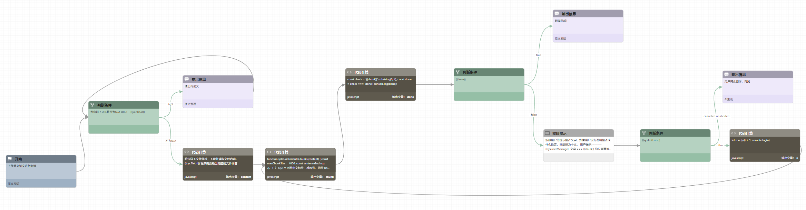

# translator-agent

#### 介绍
用于完整翻译整篇论文/文章的煎蛋智能体。不再受限与大语言模型的输出窗口大小，可以持续自动翻译整篇文章。

#### 煎蛋智能体流程

#### 使用说明

1. 创建任意煎蛋智能体
2. 点击进入智能体编辑界面
3. 点击源代码 -> 导入
4. 选择文件agent.gen，完整煎蛋流程即可导入。
5. 点击设置，修改 "无干预最多执行节点数目" 为 100或更多，取决于需要翻译的最长文章的大小。
6. 多模态选项里勾上 "文件"
7. 可选择你喜欢的大语言模型（推荐deepseek-v3）
8. 保存设置
9. 点击编辑流程，点击调试按钮，上传文章，即可自动翻译，可让智能体翻译成各种语言。

#### 注册煎蛋账号

1.  访问https://gendial.cn
2.  与右下角的煎蛋对话获取测试账号

